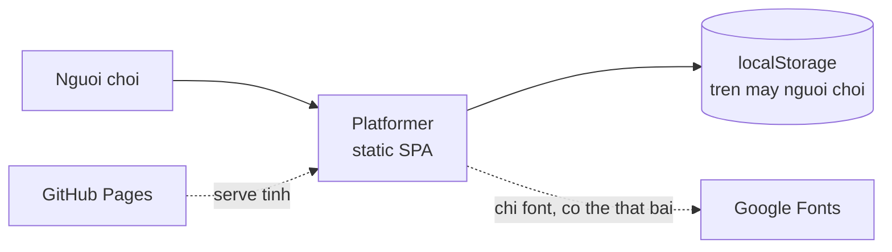
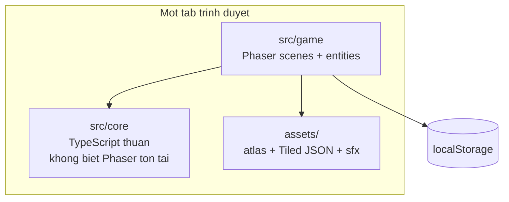

# Kiến trúc

> **Trả lời:** Hệ thống ghép lại thế nào, ranh giới giữa các phần ở đâu?
> **Trạng thái:** 🟢 đủ
> **Cập nhật:** 2026-09-08 · commit —
> **Cập nhật khi:** thêm/bỏ một module hoặc service · đổi cách hai module nói chuyện

<!-- CÁCH ĐIỀN
Mức độ: C4 mức 1 (context) và mức 2 (container). KHÔNG đi xuống class hay function —
đó là code, và code là bản mô tả chính xác nhất của chính nó.

Mục 3 (ranh giới module) là mục AI dùng nhiều nhất: nó quyết định code mới nên đặt
ở đâu. Viết mỗi module một dòng: tên · trách nhiệm một câu · được phép gọi ai.

Mục 5 chỉ ghi TÊN công nghệ + số ADR. LÝ DO chọn nằm trong ADR, không nằm đây —
nếu lý do bị chép vào đây thì hai bản sẽ lệch.

KHÔNG chứa: lý do chọn công nghệ (-> decisions/), bất biến (-> invariants.md),
schema chi tiết (-> file schema của ORM), danh sách chức năng (-> 02-requirements/scope.md).
-->

## 1. Context — hệ thống nằm giữa ai với ai

Không có backend, không có API, không có datastore phía server. Lệnh gọi ra ngoài
duy nhất là Google Fonts, và nó **được phép thất bại** (NFR-REL-01).

## 2. Container — hệ thống gồm những khối chạy được nào

Đúng một khối chạy được. `core` và `game` không phải hai process — chúng là hai
**vùng phụ thuộc**, và ranh giới giữa chúng là thứ khiến cảm giác điều khiển kiểm
thử được (invariants #2).

## 3. Module và ranh giới

| Module | Trách nhiệm một câu | Được phép gọi | **Không** được gọi |
| --- | --- | --- | --- |
| `core/tuning` | Chứa mọi con số cảm giác điều khiển, một chỗ duy nhất | — | tất cả |
| `core/movement` | Máy trạng thái thuần: (input, state, dt) → vận tốc mong muốn | `core/tuning` | `phaser`, `game/*`, `Date.now()` |
| `core/progress` | Luật mở khoá node và trạng thái hoàn thành, hàm thuần | — | `phaser`, `game/*`, storage |
| `core/scoring` | So sánh thời gian và số xu để biết có phải kỷ lục mới | — | `phaser`, `game/*` |
| `core/storage` | Đọc/ghi localStorage, validate, migrate theo `version` | `core/progress` | `phaser`, `game/*` |
| `core/scale` | Tính hệ số phóng **số nguyên** và letterbox từ kích thước viewport | — | `phaser` |
| `core/strings` | Bảng khoá → chuỗi hiển thị, ASCII-only | — | tất cả |
| `game/scenes/*` | Vòng đời màn hình, nạp asset, đấu dây input và physics | `core/*`, `phaser`, `game/*` | ghi thẳng localStorage |
| `game/entities/*` | Player, ba loại địch, khối, bệ di động, checkpoint | `core/*`, `phaser` | `core/storage` |
| `game/audio` | Phát SFX, tắt tiếng, mở khoá WebAudio ở cú chạm đầu | `phaser` | `core/*` |
| `game/textures` | Sinh texture placeholder khi chưa có atlas thật của pack | `phaser` | `core/*` |

Luật một dòng: **`core/` không biết Phaser tồn tại.** Mọi thứ chạm vào Phaser sống
trong `game/`.

## 4. Luồng dữ liệu của đường đi quan trọng nhất

**Một frame trong lúc chơi:**

1. `GameScene.update(time, dt)` đọc input thật — bàn phím, hoặc nút cảm ứng — và
   gói thành một `InputSnapshot` phẳng (`left`, `right`, `jumpDown`, `jumpHeld`).
2. Gọi `core/movement.step(state, snapshot, dt)`. Hàm này **thuần**: nó cộng
   coyote time, jump buffer, gia tốc theo thời gian giữ hướng, rồi trả về
   `{ vx, vy, nextState }`. Nó không biết va chạm là gì.
3. `GameScene` áp `vx`/`vy` lên Arcade body của player. Arcade Physics giải va chạm
   với tilemap và với các group.
4. Callback va chạm **không sửa UI**. Chúng phát sự kiện miền qua event bus của
   scene: `coinCollected`, `playerHit`, `powerUpTaken`, `blockBroken`,
   `checkpointReached`, `levelCompleted`, `playerDied`.
5. `HUDScene` nghe các sự kiện đó và vẽ lại tim / xu / đồng hồ.
6. `game/audio` cũng nghe các sự kiện đó và phát SFX. Không có lời gọi SFX nào nằm
   rải trong logic gameplay.

**Xong một màn:**

`levelCompleted` → `core/scoring` so với kỷ lục cũ → `core/progress` tính tiến độ
mới → `core/storage` validate rồi ghi → `WorldMapScene` đọc lại và vẽ đường mới.

Sự kiện đi **một chiều**: gameplay → sự kiện → (HUD, audio, progress). Không có
chiều ngược lại. Đó là lý do HUD là scene riêng chứ không phải một lớp trong
`GameScene`.

## 5. Tech stack

| Lớp | Công nghệ | Biện minh |
| --- | --- | --- |
| Engine | Phaser 3.90 | ADR-0001 |
| Physics | Arcade Physics (không Matter/Box2D) | ADR-0001 |
| Soạn màn chơi | Tiled → JSON | ADR-0001 |
| Ngôn ngữ | TypeScript | ADR-0001 |
| Build | Vite · npm | ADR-0001 |
| Test | Vitest (`core/`) · Playwright (một smoke test) | ADR-0001 |
| Art | Pixel Adventure — CC0 | ADR-0002 · ADR-0006 |
| Design token | `docs/design-system/platformer/MASTER.md` | ADR-0002 |
| Âm thanh | SFX tổng hợp bằng WebAudio | ADR-0007 |
| Deploy | GitHub Pages, static | ADR-0001 |
